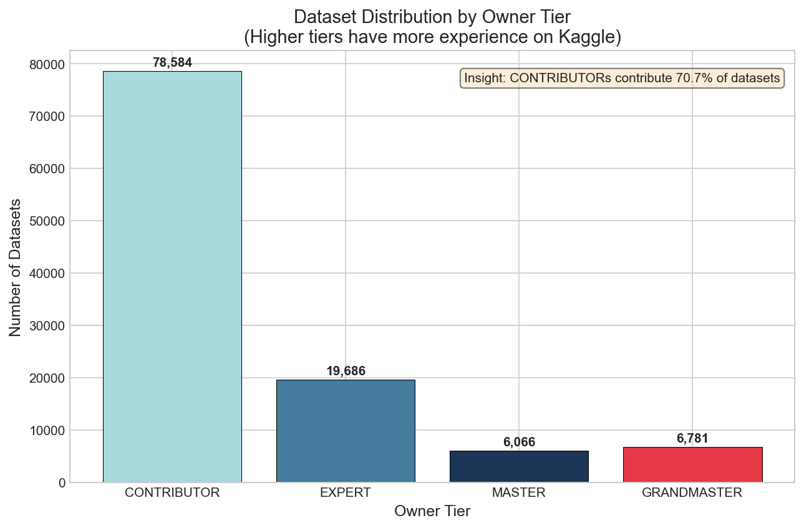
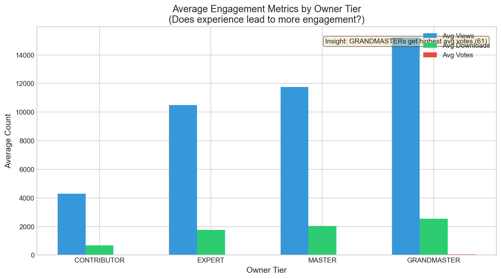
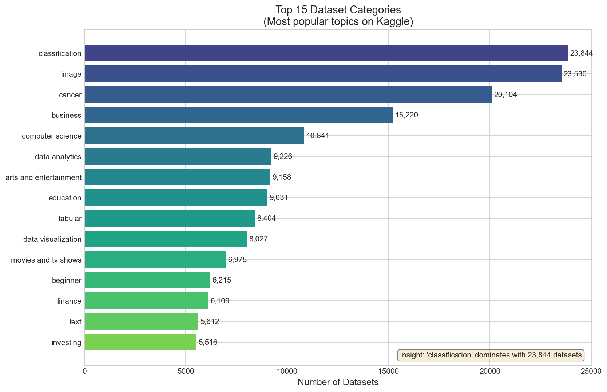
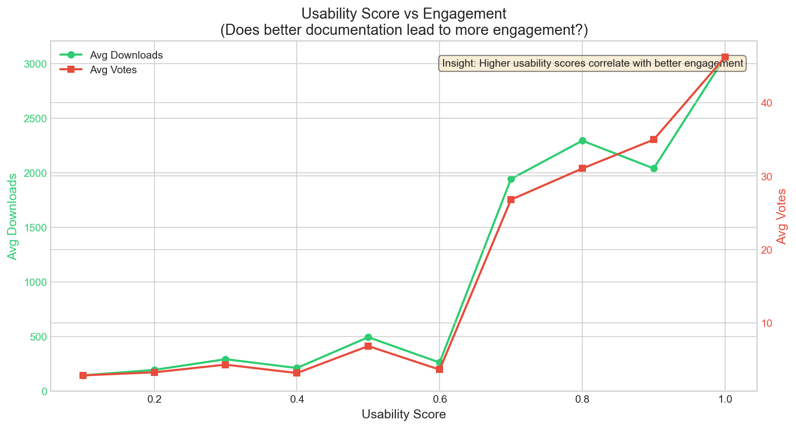
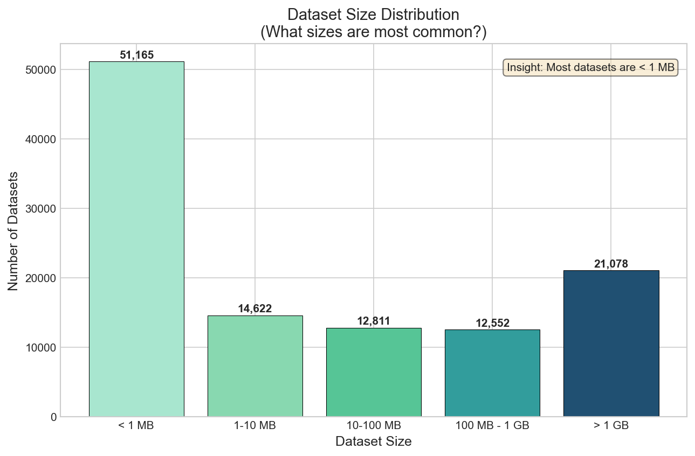
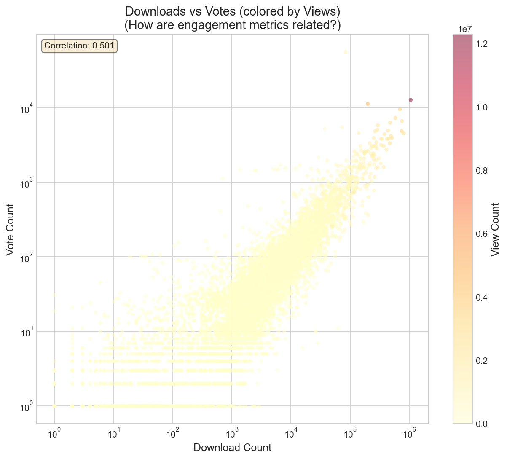
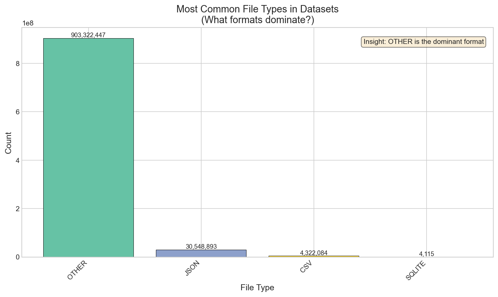
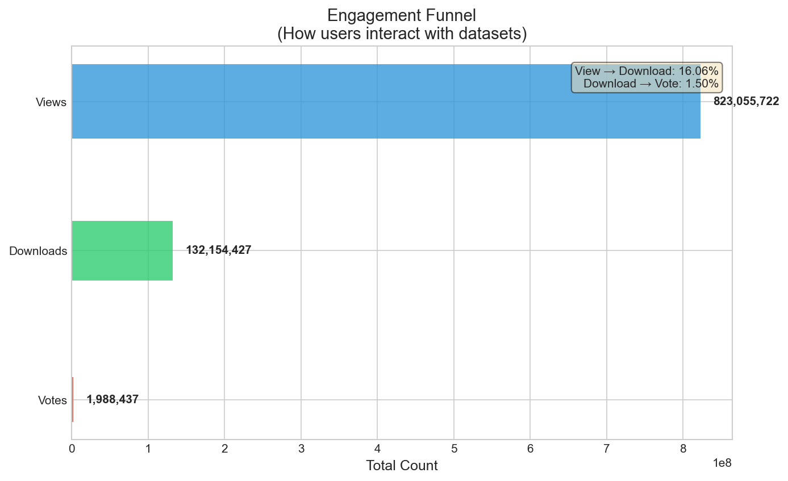

# Kaggle Dataset Ecosystem Analysis

> Comprehensive analysis of **122,629** Kaggle datasets to understand engagement patterns and ecosystem dynamics.

## Key Metrics

| Metric | Value |
|--------|-------|
| Total Datasets Analyzed | **122,629** |
| Total Views | **828,422,590** |
| Total Downloads | **132,775,416** |
| Total Votes | **2,001,496** |
| Average Usability Score | **0.62** |
| Top Category | **classification** (23,844 datasets) |
| Most Active Tier | **CONTRIBUTOR** (87,997 datasets) |

---

## Insights & Charts

### 1. Who Creates Datasets?

**Insight:** The majority of datasets come from CONTRIBUTOR tier users. Building your Kaggle profile through competitions and notebooks can increase your dataset visibility.

---

### 2. Does Experience Lead to More Engagement?

**Insight:** Higher-tier users generally receive more engagement on their datasets. Reputation and community trust play a significant role.

---

### 3. Most Popular Topics

**Insight:** Understanding trending categories helps you create datasets that the community actively seeks.

---

### 4. Choosing the Right License

**Insight:** Open licenses (CC0, CC BY) dominate. Making your data freely available increases adoption and engagement.

---

### 5. Quality Matters: Usability Score Impact

**Insight:** Datasets with higher usability scores (better documentation, column descriptions, proper formatting) receive significantly more engagement.

---

### 6. Optimal Dataset Size

**Insight:** Most popular datasets are small to medium-sized. Users prefer datasets they can quickly download and explore.

---

### 7. Engagement Correlation

**Insight:** Downloads and votes are correlated but not perfectly. Quality content generates votes; utility drives downloads.

---

### 8. Top Dataset Creators

**Insight:** Prolific creators build audiences. Consistent publishing increases overall visibility.

---

### 9. Popular File Formats

**Insight:** CSV dominates. Keep your data in accessible, standard formats for maximum reach.

---

### 10. The Engagement Funnel

**Insight:** Only a small fraction of views convert to downloads, and even fewer to votes. Focus on making your dataset immediately useful.

---

## Recommendations for Maximum Engagement

Based on this analysis, here are actionable tips:

1. **Maximize Usability Score** - Add column descriptions, cover image, proper tags
2. **Use Open Licenses** - CC0 or CC BY 4.0 are most popular
3. **Optimal Size** - Keep datasets under 100MB when possible
4. **CSV Format** - Provide data in CSV for maximum accessibility
5. **Target Popular Categories** - Align with trending topics like ML, business, health
6. **Build Your Profile** - Higher tier = more credibility = more engagement
7. **Write Great Documentation** - Clear overview and use cases drive downloads
8. **Consistent Publishing** - Regular contributions build audience

---

## Data Source

📊 **Dataset:** [Kaggle Datasets Metadata](https://www.kaggle.com/datasets/ismetsemedov/kaggle-datasets)

This analysis is based on data collected from Kaggle's public dataset API, covering 122,629 unique datasets across all categories and time periods.

**Last Updated:** 2025-12-19 12:20
